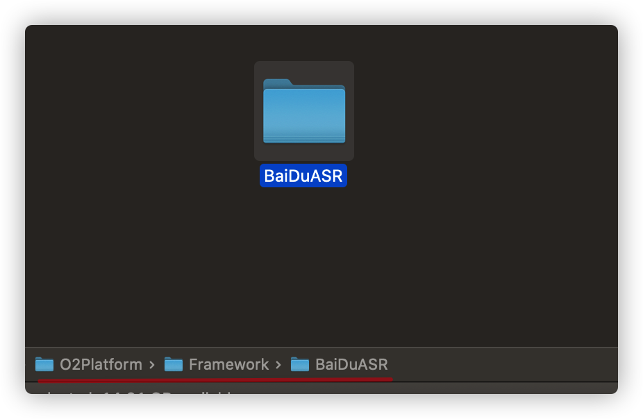
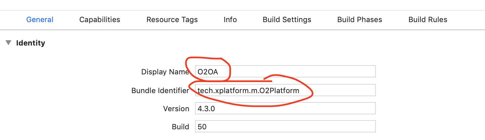
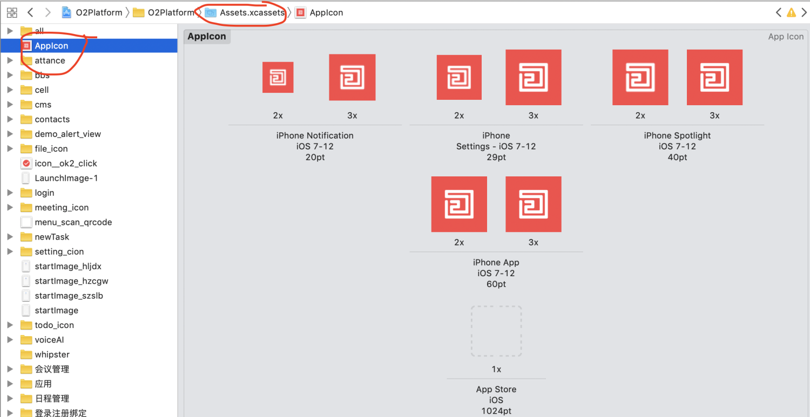
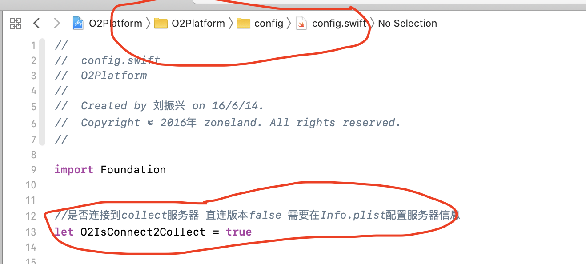
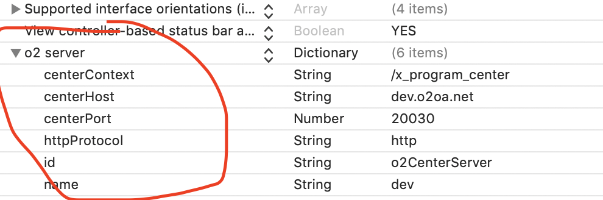

# O2OA 企业信息化办公平台 iOS端源码


O2OA平台 iOS 客户端，最低支持IOS版本10.0，编程语言使用swift 。

## 准备

Xcode版本 使用最新的版本


项目使用了COCOAPODS，需要本地安装最新版本的COCOAPODS。 然后到项目根目录执行pod命令：

```shell
# pod install
```


## 导入项目

在项目根目录找到 `O2Platform.xcworkspace` ，双击打开项目。 在XCode中找到菜单 ： File -> Workspace Settings ... 修改Build System 选项为 `Legacy Build System` 


------

百度语音的SDK 包，因为比较大，所以没有放到源码里面

百度语音外部包：[📎BaiDuASR-ios百度语音扩展包.zip](https://www.yuque.com/attachments/yuque/0/2020/zip/501589/1598593095547-810a5f9b-75cf-4108-b931-a1b5266087d0.zip)

这个包解压到 O2Platform > Framework 目录下。




## 项目基本信息修改

### 项目名称

项目名称就是ios手机桌面上显示的名称，这个名称修改如下，还有一个是app唯一ID也需要修改：

 



 


### 项目桌面LOGO

这个LOGO是在IOS手机桌面上显示那个图标，找到Assets资源目录，替换AppIcon里面的图片。如下图：




 


## 第三方SDK配置


在项目源码中O2Platform -> config -> config.swift 文件中找到对应的第三方SDK的key：

```swift

let BUGLY_ID = 腾讯Bugly AppId
//极光
let JPUSH_APP_KEY = 极光推送AppKey
//百度
let BAIDU_MAP_KEY = 百度地图Appkey
let BAIDU_ASR_APP_ID = 百度语音AppId
let BAIDU_ASR_APP_KEY = 百度语音Appkey
let BAIDU_ASR_APP_SECRET = 百度语音Secret
```


这些key需要根据自己的app的 `Bundle Identifier` 到各个平台上自行注册。


## 直连版本配置


如果你不希望连接到我们的O2云，通过修改配置编译打包，生成的IOS应用，就会直接连接到你们自己的O2OA服务器。

直连版本的极光消息推送需要额外配置：[《O2OA移动端APP直连版本如何开启消息推送》](https://www.yuque.com/docs/share/d9b8e231-bfcc-48cf-a671-141fd927f78f?# 《O2OA移动端APP直连版本如何开启消息推送》)

修改方式如下：  




在 O2Platform -> config -> config.swift 文件中找到

```swift
//改为false就是直连版本
let O2IsConnect2Collect = false
```


然后找到O2Platform 目录下找到Info.plist文件，把里面的centerHost 、 centerPort、httpProtocol改成你们自己的O2OA中心服务器地址信息。





